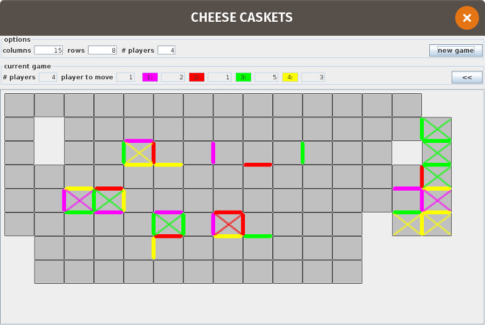

# CheeseCaskets
Implementation of the paper based game "Käsekästchen"

The German game [Käsekästchen](https://de.wikipedia.org/wiki/K%C3%A4sek%C3%A4stchen) is a paper and pencil game everybody loved to play in school back in the day, whenever the subject was boring. It is similar, I am told, to [Dots and Boxes](https://en.wikipedia.org/wiki/Dots_and_Boxes).

This is a just for fun project to bring back old memories to current technology :-).

# Game description

The game is quite simple; it is played by 2 to 4 players on a plane with a roughly rectangular collection of cells - which are called caskets. Each casket is a square with 4 sides, but only the sides that are shared with a neighboring casket of the game layout are important to the game; these are the "collectable" sides.

After the game starts, each player makes his/her move in turn, by choosing one of the collectable sides of a square (by clicking on it). This side - belonging to 2 caskets - is marked with the colour of the active player and is then "collected". When- ever a player manages to collect the last side of a casket, this casket is awared to him/her and marked with a cross in the respective colour. If the player is awared at least one casket the same player retains the initiative and moves again!

She/he, who get's awareded the most caskets, wins!

## Stategy
Just one hint: try choose the side in such a way, that the next player in line can not conquer a casket.

# Dependencies
## JGoodies
The project depends on 2 JGoodies libraries (Forms and Common).
[You can download](http://www.jgoodies.com/downloads/archive/) free versions of these.
I used
- JGoodies Forms 1.8.0
- JGoodies Common 1.8.1

The downloadable ZIP- archives contain also source, documentation and test-utils, for this project we only need the
jar- archives within these, e.g. "jgoodies-forms-1.8.0.jar" and "jgoodies-common-1.8.1.jar".

## Java
As the game is written in Java, a Java runtime and compiler with Swing installed is needed.
I tested it with a jdk 1.8.0_191 on Linux (a Ubuntu 18.04 variant, AMD64).

# Compile and run
Place the 2 JGoodies jar- files within the project folder, and on a Linux (bash) command- line, go to the project folder

    javac -d ./bin -sourcepath ./src -cp ./jgoodies-forms-1.8.0.jar src/de/schini/cheesecaskets/*.java
    java -cp ./jgoodies-forms-1.8.0.jar:./jgoodies-common-1.8.1.jar:./bin de.schini.cheesecaskets.CheeseCasketsSwing
